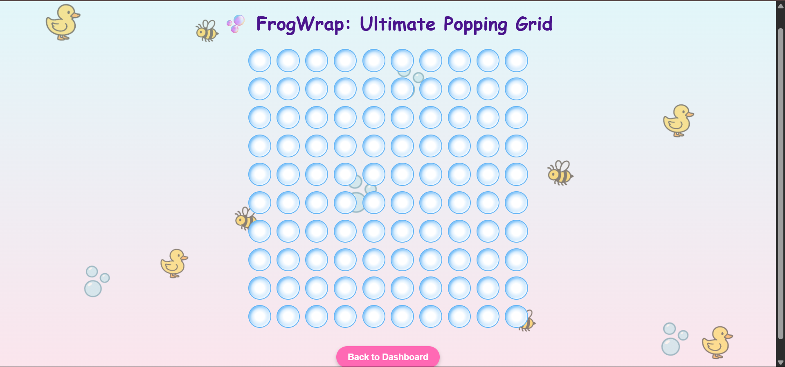
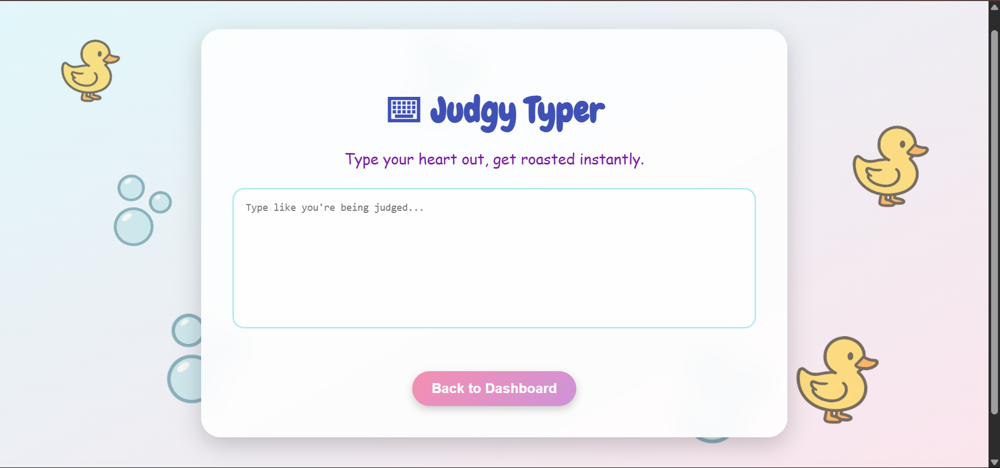
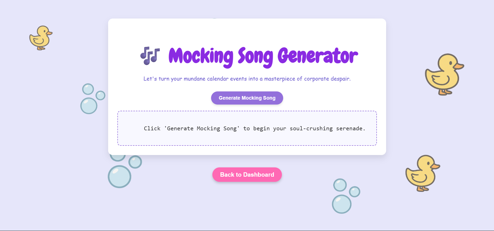

🎯  StressBuster

🧠 Basic Details

**Team Name:** ctrl+she
**Team Members:**

* **Team Lead:** Ashna Thajudheen – Adi Shankara Institute of Engineering and Technology,Kalady
* **Member 2:** Devika Sajith – Adi Shankara Institute of Engineering and Technology,Kalady
---

## 📜 Project Description

A delightfully useless “stress relief” app for corporate employees that pretends to help, but really just makes things worse — hilariously. Features include sarcastic bubble popping, a judging typer, a duck-quacking chaotic calendar, and a roast-song generator.

---

## 🚨 The Problem (that doesn’t exist)

Corporate employees are just *too productive*. They need distractions that look like productivity but are actually chaos in disguise.

---

## 💡 The Solution (that nobody asked for)

We built a “relief” portal that:

* Pops fake bubble wrap but with duck and frog noises
* Roasts users for how they type and ruins their words
* Schedules fake events in a duck-themed calendar that mocks deadlines
* Writes embarrassing songs 

You're welcome, overachievers.

---

## 🧪 Technical Details

### 💻 For Software:

* **Languages Used:** HTML, CSS, JavaScript
* **Frameworks Used:** None (raw chaos)
* **Libraries Used:**

  * FullCalendar.js
  * Tippy.js (for sarcasm tooltips)
  * Google Fonts
  * 
* **Tools Used:**

  * GitHub
  * VS Code
  * Git

### 🔧 For Hardware:

None. This project is too useless for hardware.

---

## 🛠️ Implementation

### 💾 For Software:

#### Installation

No real installation needed. Just clone and run:

```bash
git clone https://github.com/AshnaThajudheen/Useless_Project.git
cd Useless_Project
```

#### Run

If running locally:

```bash
python -m http.server 8000
```

Then open `http://localhost:8000` in your browser.

---

## 📷 Project Documentation

### Screenshots

.png)
*Landing page with smooth scroll and floating chaos ducks.*

.png)


*Bubble wrap popping simulator with ridiculous sounds like frogs and minions.*


*Chaotic CalenDuck that randomly reshuffles your fake deadlines and plays quacks.*


*Judgy typer that mocks your speed and replaces words like “meeting” with “meating.”*


*Turn your calendar chaos into satirical serenades with our Mocking Song Generator.*


---

### Diagrams


*Workflow: Fake input → Sarcastic response → Useless outcome → Quack → Laugh*

---

## 🎥 Project Demo

### Video

[🔗 Demo Video](Demo/demo1.mp4)
[🔗 Demo Video](Demo/demo2.mp4)
*A full walk-through of the most unhelpful stress relief app ever created.*

---

## 🙋 Team Contributions

* **Ashna Thajudheen:** Bubble wrap simulator, UI enhancements, scroll-based layout, roast song system,sound integration 
* **Devika Sajith:** Idea generation, calendar quack logic, UI design,Typing game logic,sarcasm content writing
  

---

